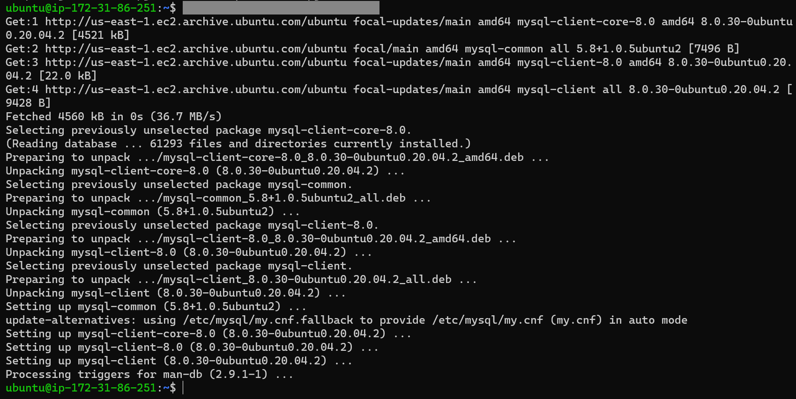

1. Create and configure two Linux-based virtual servers (EC2 instances in AWS).

2. On mysql server Linux Server install MySQL Server software.   
To install the software, we need to update the ubuntu by running the following command  
To update ubuntu `sudo apt update -y`  

To install mysql server `sudo apt install mysql-server -y`

3. On mysql client Linux Server install MySQL Client software.  
To install the software, we need to update the ubuntu by running the following command  
To update ubuntu `sudo apt update -y`

To install mysql client 
`sudo apt install mysql-client -y`

4. We need to create an inbound rule in EC2 AWS server. By default MySQL server uses TCP port 3306. For security, I will allow access from the client by inputing the client public ip address

Before working on step 5, we need to do the following:
- To improve the security of mysql installation
`sudo mysql_secure_installation`

- Create your own password and say yes to all the questions
- To log in to mysql
`mysql -u root -p`
- Creating a user and database and also, granting the user access to the database
- Creating a remote user
`CREATE USER 'remote_user'@'%' IDENTIFIED WITH mysql_native_password BY 'password';`
- Creating a database called 'test_db'
`CREATE DATABASE test_db;`
- Granting a user permissions
`GRANT ALL ON test_db.* TO 'remote_user'@'%' WITH GRANT OPTION; `
- To reload the grant tables to ensure that the new priviliges are put to effect
`FLUSH PRIVILEGES;`
- To come out of mysql
`exit`

5. To configure MySQL server to allow connections from remote hosts
`sudo vi /etc/mysql/mysql.conf.d/mysqld.cnf`
change bind-address from 127.0.0.1 to 0.0.0.0 and 
Restart mysql
`sudo systemctl restart mysql`

6. From mysql client Linux Server connect remotely to mysql server Database Engine without using SSH. You must use the mysql utility to perform this action.
- To remote from client ssh
`sudo mysql -u remote_user -h (ip address of database server) -p
`sudo mysql -u remote_user -h 3.87.42.81 -p`

7. Check that you have successfully connected to a remote MySQL server and can perform SQL queries:
`Show databases;`

